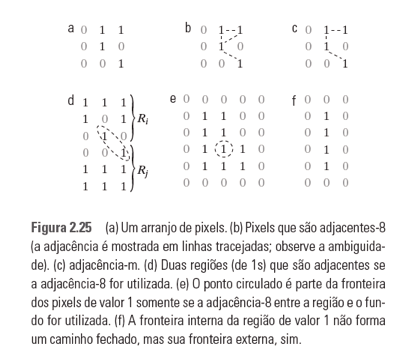

```
Processamento Digital de Imagens
```

## Modelo matemático de formação de imagem

Uma imagem pode ser definida como uma função bidimensional $$f(x,y)$$ em que $$x$$ e $$y$$ são coordenadas espaciais \(plano\) e a amplitude de $$f$$ em qualquer par de coordenadas $$(x,y)$$ é chamada **intensidade** ou **nível de cinza** da imagem nesse ponto. Quando $$x$$, $$y$$ e os valores de intensidade de $$f$$ são quantidades finitas e discretas, chamamos de **imagem digital**.

A função $$f(x,y)$$ pode ser caracterizada por dois componentes:  
1. **iluminação**: representada por $$i(x,y)$$, indica a quantidade de iluminação da fonte que incide na cena que está sendo vista; e  
2. **refletância**: representada por $$r(x,y)$$, indica a quantidade de iluminação refletida pelos objetos na cena.

Ao combinar as duas funções temos:


$$
f(x,y) = i(x,y) \times r(x,y)
$$


onde:

* $$0 \lt i(x,y) \lt \infty$$
* $$0 \lt r(x,y) \lt 1$$

Os limites da refletância são chamados de:

* $$0$$: absorção total
* $$1$$: refletância total 

## Amostragem e quantização de imagens

A figura a seguir mostra uma imagem contínua $$f$$ que queremos converter em formato digital. Para isso, temos de fazer a amostragem da função em ambas as coordenadas e na amplitude. A digitalização dos valores de coordenada é chamada **amostragem**. A  digitalização dos valores de amplitude é chamada de **quantização**.


A figura a seguir ilustra o resultado do processo de amostragem e quantização.


## Representação do pixel \(valores de intensidade\)

A forma mais comum de representar $$f$$ é na forma de uma matriz $$M \times N$$ em que cada elemento $$a_{i,j}$$ está associado a um pixel na coordenada $$(x,y)$$. Nessa representação, $$x = 0, 1, 2, ..., M - 1$$ e $$y = 0, 1, 2, ..., N - 1$$.

Outra forma de representar $$f$$ é utilizando um vetor em que a relação entre o índice do vetor e o pixel da matriz é dada por:


$$
i = x + M \times y
$$


As posições $$x$$ e $$y$$ de um pixel para um índice $$i$$ do vetor podem ser obtidas por:


$$
x = i \mbox{ mod } M \\
y = \frac{i}{M}
$$


A imagem digital é composta por elementos chamados **pixels**, cada qual armazenando um valor de intensidade. O valor de intensidade é representado em um intervalo:


$$
[0, 2^b - 1]
$$


onde $$b$$ representa a quantidade de bits ou a **profundidade de bits** da imagem. Geralmente, este valor é limitado em 8 bits por banda do espectro de cor.

No caso de imagens monocromáticas, há apenas uma banda \(por isso são geralmente chamadas **imagens em tons de cinza**\).

No caso de imagens coloridas, pode haver mais de duas bandas. O sistema de cor RGB \(do inglês _Red, Green, Blue_\) representa três bandas baseadas nas cores primárias vermelho, verde e azul.

## Padrões de representação da imagem em programação \(e algoritmos\)

Ao adotarmos a forma de representação da imagem por uma matriz $$M \times N$$ costumamos trabalhar com os índices $$i$$, para linhas, e $$j$$, para colunas. Assim, o algoritmo a seguir ilustra um percurso por todos os pixels da imagem:

```
para i de 0 até (M - 1) faça
    para j de 0 até (N - 1) faça
        I(i,j) representa o pixel da linha i, coluna j
    fim-para
fim-para
```

## Relacionamentos entre pixels

### Vizinhos de um pixel

Um pixel $$p$$ na coordenada $$(x,y)$$ tem quatro vizinhos horizontais e verticais, cujas coordenadas são dadas por:


$$
(x+1,y), (x-1,y), (x,y+1), (x,y-1)
$$


Esse conjunto de pixels, chamado de **vizinhança-4** de $$p$$ é expresso por $$N_4(p)$$.

Os quatro vizinhos diagonais de $$p$$ têm coordenadas:


$$
(x+1,y+1), (x+1,y-1), (x-1,y+1), (x-1,y-1)
$$


que são expressas por $$N_D(p)$$. A união desses conjuntos forma a **vizinhança-8** de p, expressa por $$N_8(p)$$.

### Adjacência e conectividade, regiões e fronteiras

Expressamos por $$V$$ o conjunto de valores de intensidade utilizados para definir a adjacência. Há três tipos:

* **adjacência-4**: dois pixels $$p$$ e $$q$$ com valores pertencendo a $$V$$ são adjacentes se $$q$$ estiver no conjunto $$N_4(p)$$;
* **adjacência-8**: dois pixels $$p$$ e $$q$$ com valores pertencendo a $$V$$ são adjacentes-8 se $$q$$ estiver no conjunto $$N_8(p)$$;
* **adjacência-m**: dois pixels $$p$$ e $$q$$ com valores pertencendo a $$V$$ são adjacentes-m se: a\) $$q$$ estiver em $$N_q(p)$$; ou b\) $$q$$ estiver em $$N_D(p)$$ e o conjunto $$N_4(p) \cap N_4(q)$$ não contiver nenhum pixel cujos valores pertençam a V.

A figura a seguir ilustra esse conceito.



Um **caminho** \(ou curva\) do pixel $$p$$ com coordenadas $$(x,y)$$ para o pixel $$q$$ com coordenadas $$(s, t)$$ é uma sequência de pixels distintos com coordenadas:


$$
(x_0,y_0),(x_1,y_1),...,(x_n,y_n)
$$


onde $$(x_0,y_0)=(x,y),(x_n,y_n)=(s,t)$$ e os pixels $$(x_i,y_i)$$ e $$(x_{i-1},y_{i-1})$$ são adjacentes para $$1 \leq i \leq n$$. Nesse caso, $$n$$ é o comprimento do caminho.

> Sugestão de leitura: Capítulos 1 e 2 de \(GONZALEZ e WOODS, 2011\)


